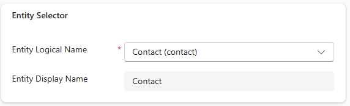
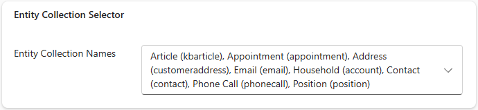
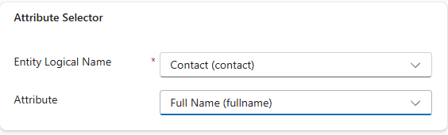
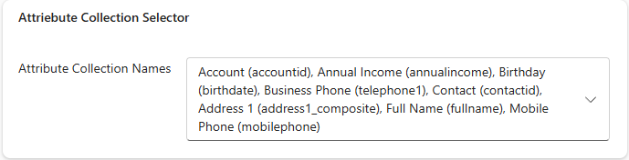
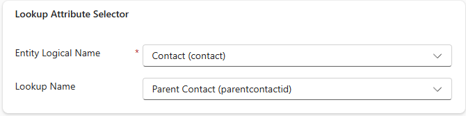
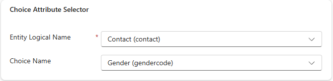
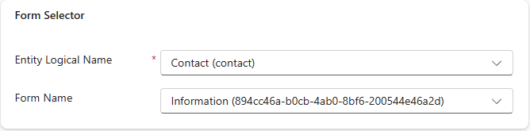
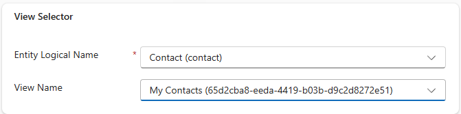

<h2>Metadata PCF virtual controls</h3>

<h3>Intro</h3>
This project contains a set of PCF virtual controls that allow easy access to the Dataverse metadata. The controls allow the selection of entities, attributes, forms, views, and relationships and store them in standard Dataverse text fields for use elsewhere within the solution.

These controls were built to simplify the need to use custom scripting to access the metadata from your web resource files and the need to rewrite this logic in other places. 

You can download these controls directly from the repo in both Unmanaged and Managed format, or download the source code and modify or use the controls as needed.

<h3> Available controls</h3>

**Entity Selector**

A fluent ui dropdown control that allows the selection of an entity and stores it's logical name. 
The control allows you to store the display name of the entity as well in an alternate field.   

Properties:
Entity - *Required* Bound singleline text field  
Display Name - *Optional* Bound singleline text field.

**Entity Collection Selector**

A fluent ui dropdown control that allows the selection of multiple entities and stores their logical names as a comma separate list. 

Properties: 
Entity - *Required* Bound singleline or multiline text field  

**Attribute Selector**

A fluent ui dropdown control that displays and allows you to select an attribute from the specified entity. 
The control stores the logical name of the attribute and displays it in a user friendly format *Display Name (logical name)*.

Properties:
Attribute - *Required* Bound singleline text field  
EntityName - Singleline text field input (usually set to the Select Entity field elsewhere on the form)

**Attribute Collection Selector**

A fluent ui dropdown control that displays and allows the selection of multiple attributes from the specified entity and stores their logical names as a comma separated list. 

Properties:-  
Attribute - *Required* Bound singleline text field  
EntityName - Singleline text field input (usually set to the Select Entity field elsewhere on the form)

**Lookup Attribute Selector**

A fluent ui dropdown control that provides the variation of the Attribute Selector control that filters the list of attributes to only show lookup fields from the specified entity. 
The control stores the logical name of the lookup field and displays it in a user friendly format - *Display Name (logical name)*  

Properties:-  
Attribute - *Required* Bound singleline text field  
EntityName - Singleline text field input (usually set to the Select Entity field elsewhere on the form)

**Choice Attribute Selector**

A fluent ui dropdown control that provides the variation of the Attribute Selector control that filters the list of attributes to only show choice fields from the specified entity. 
The control stores the logical name of the choice field and displays it in a user friendly format - *Display Name (logical name)*  

Properties:
Attribute - *Required* Bound singleline text field  
EntityName - Singleline text field input (usually set to the Select Entity field elsewhere on the form)

**Form Selector**

A fluent ui dropdown control that displays and allows you to select a form from the list of forms of the specified entity. 
The control stores the unique identifier value of the Form and displays the Form's name.
 
Properties:
Form - *Required* Bound singleline text field  
EntityName - Singleline text field input (usually set to the Select Entity field elsewhere on the form)

**View Selector**

A fluent ui dropdown that displays and allows you to select a view from the the list of available views for a specified entity. 
The control stores the Guid value of the View and displays the views user friendly name.
 
Properties:
Attribute - *Required* Bound singleline text field  
EntityName - Singleline text field input (usually set to the Select Entity field elsewhere on the form)

**Related Attribute Selector**

A fluent ui dropdown control that allows the selection of the preferred join column (lookup) to join between two entities (Form entity and Query entity). 
The control stores the logical name of the lookup field.  

Properties:-  
Attribute - *Required* Bound singleline text field  
FormEntity -  *Required* Singleline Bound text field 
QueryEntity -  *Required* Singleline Bound text field 

Note: The source of these controls were originally taken from the following repo:
https://github.com/bthompson-365/PCF-Metadata

The controls have been heavily modified and converted to virtual controls using the latest React and Fluent UI version 9.
The original Select Action and Select Relationship control have been ommitted, but will be part of or enhanced in the next release.
Additional controls will be added to this repo to perform other metadata operations, or other operations that are not available directly via Model Driven Apps.

Upcoming Controls:
App Selector: Provides the ability to select a Model Driven App by Name and Id
Custom API Selector: Provides the ability to select a Custom API

If there are additional controls that you are interested in, please let me know.

